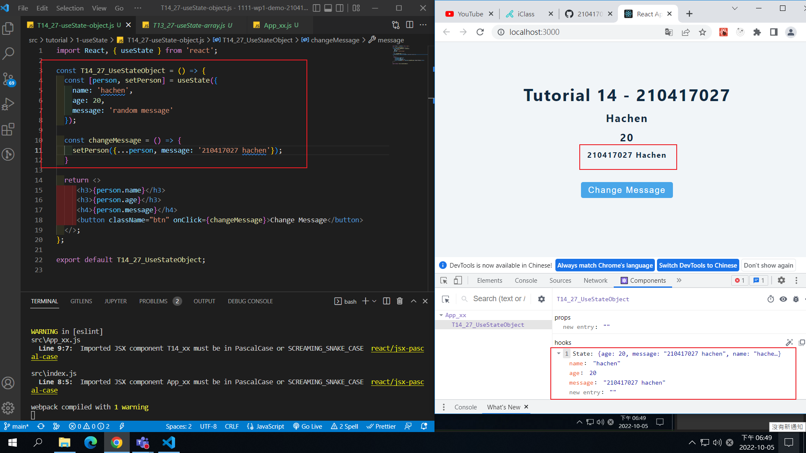
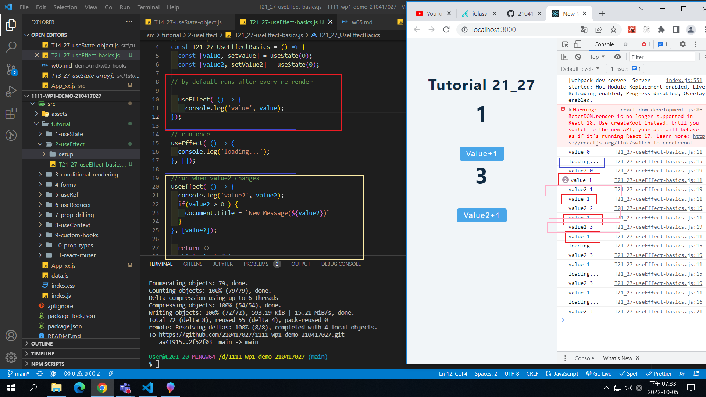
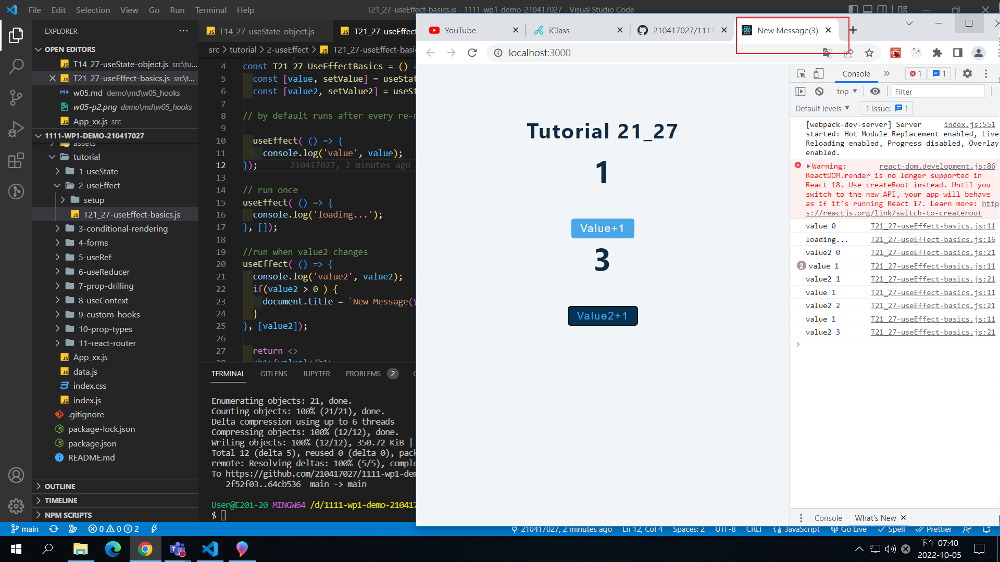
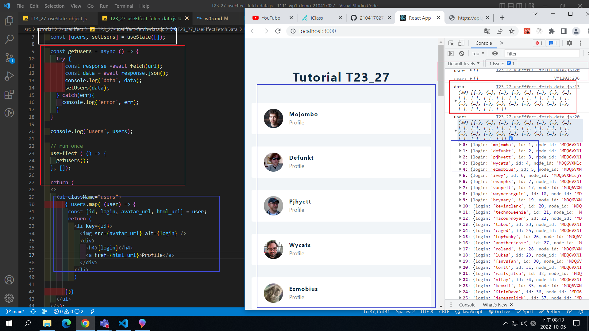
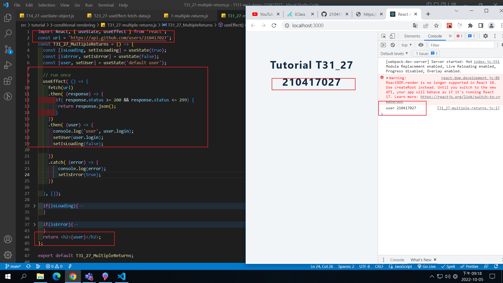
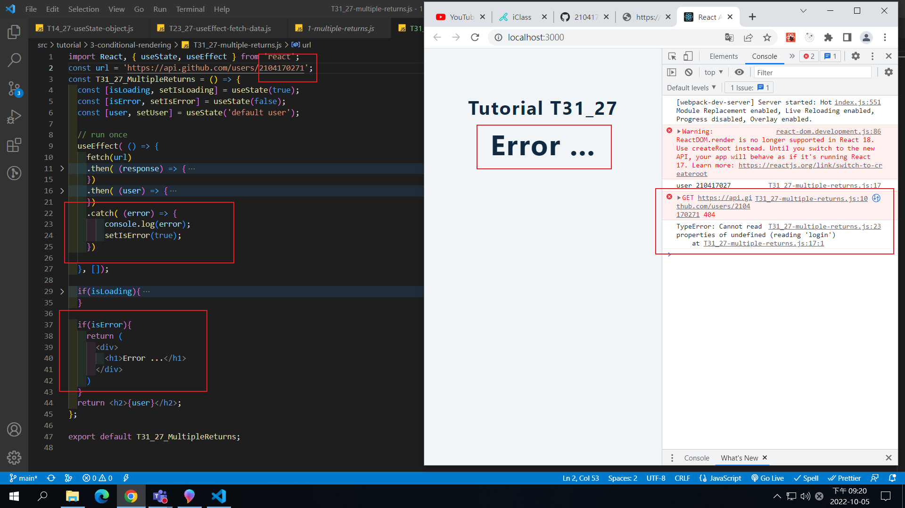
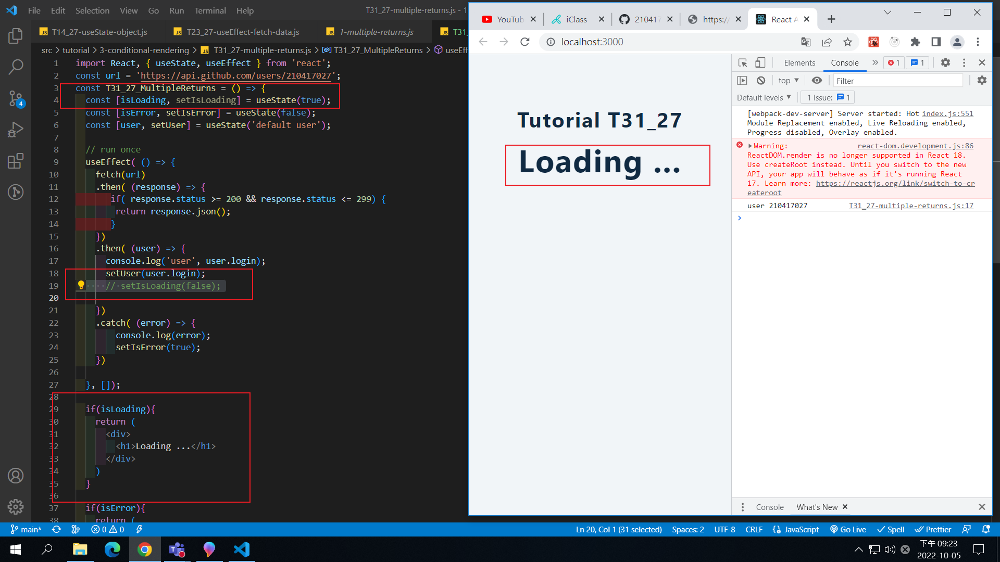
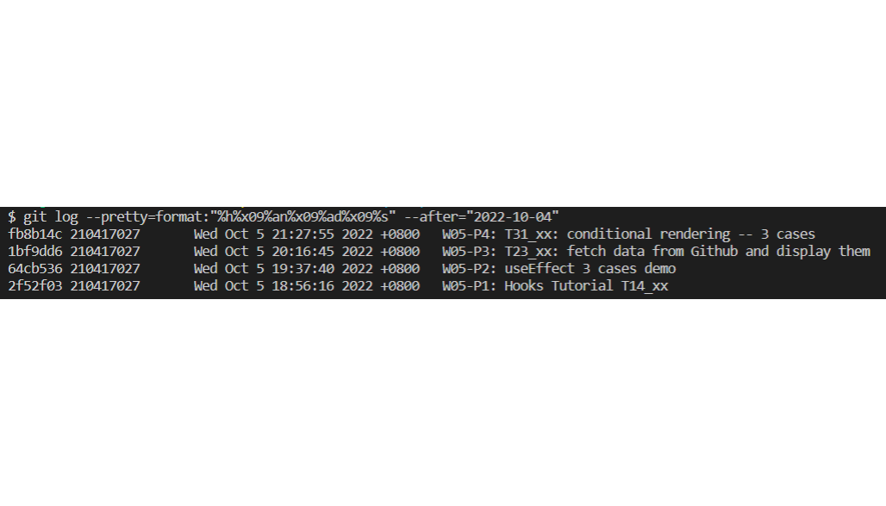

### W05-P1: Hooks Tutorial T14_xx



### W05-P2: useEffect 3 cases demo





### W05-P3: T23_xx: fetch data from Github and display them



### W05-P4: T31_xx: conditional rendering -- 3 cases





### w05-logs



```
fb8b14c 210417027       Wed Oct 5 21:27:55 2022 +0800   W05-P4: T31_xx: conditional rendering -- 3 cases
1bf9dd6 210417027       Wed Oct 5 20:16:45 2022 +0800   W05-P3: T23_xx: fetch data from Github and display them
64cb536 210417027       Wed Oct 5 19:37:40 2022 +0800   W05-P2: useEffect 3 cases demo
2f52f03 210417027       Wed Oct 5 18:56:16 2022 +0800   W05-P1: Hooks Tutorial T14_xx
```
