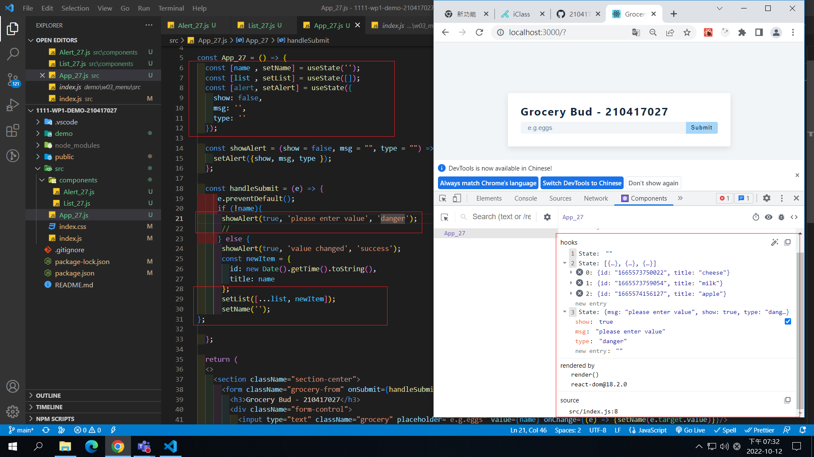
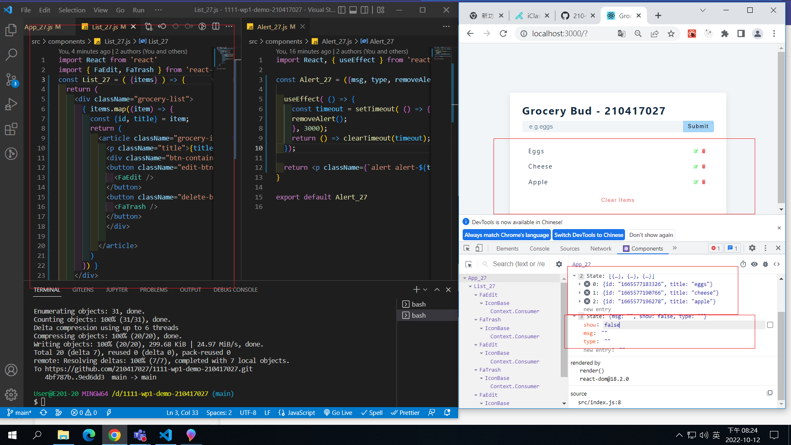
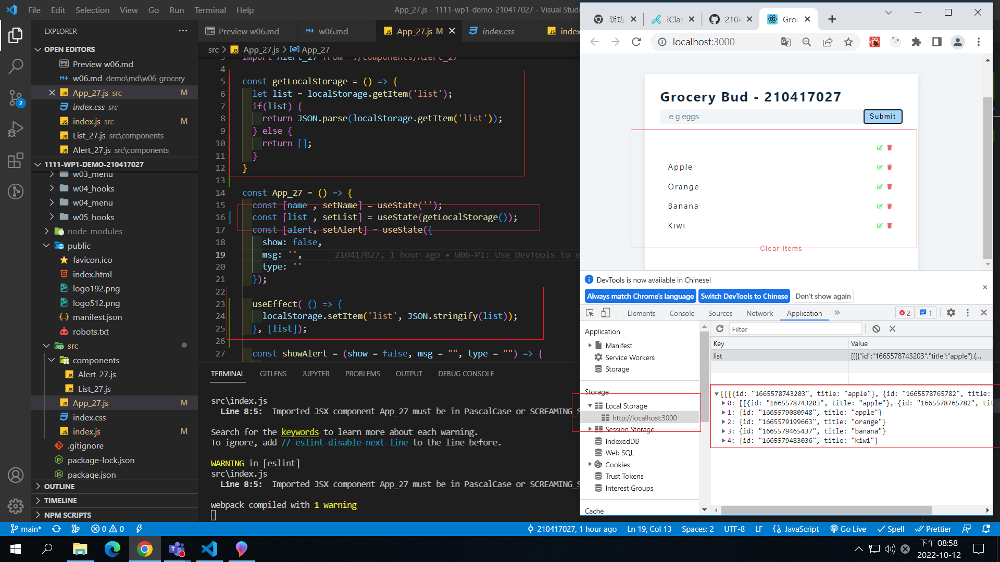
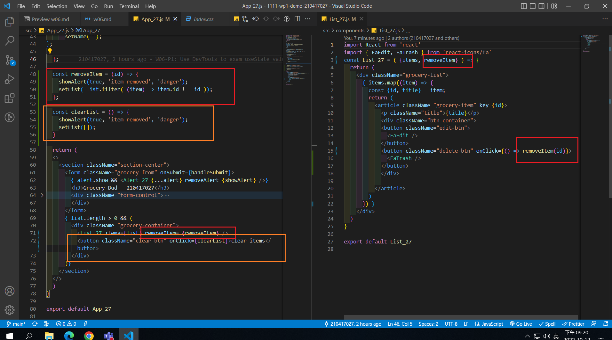
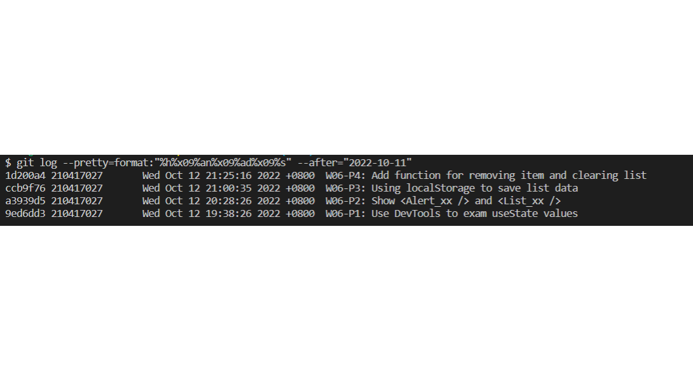

[GITHUB](https://github.com/210417027/1111-wp1-demo-210417027)

### W06-P1: Use DevTools to exam useState values



### W06-P2: Show <Alert_xx /> and <List_xx />



### W06-P3: Using localStorage to save list data



### W06-P4: Add function for removing item and clearing list



### W06-logs: show all four logs done today



```
1d200a4 210417027       Wed Oct 12 21:25:16 2022 +0800  W06-P4: Add function for removing item and clearing list
ccb9f76 210417027       Wed Oct 12 21:00:35 2022 +0800  W06-P3: Using localStorage to save list data
a3939d5 210417027       Wed Oct 12 20:28:26 2022 +0800  W06-P2: Show <Alert_xx /> and <List_xx />
9ed6dd3 210417027       Wed Oct 12 19:38:26 2022 +0800  W06-P1: Use DevTools to exam useState values
```
