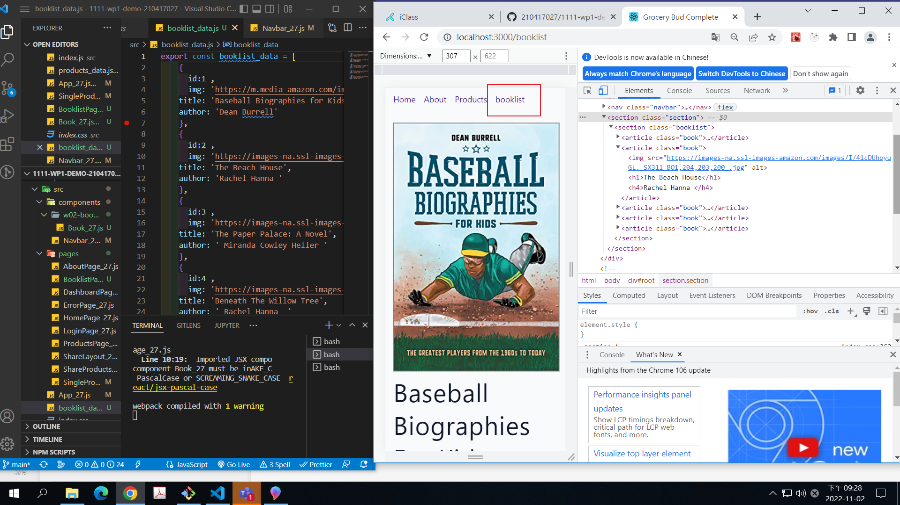

### W09_P1: setup for router tutorial


### W09-P2: <SharedLayout_xx /> with route /products


### W09-P3: find a product using productId using your last digit of ID


### W09-P4: add a route /booklist to show the booklist in w02




### w05: git log


```
f905b85 210417027       Wed Nov 2 21:29:25 2022 +0800   W09-P4: add a route /booklist to show the booklist in w02
a3548c1 210417027       Wed Nov 2 21:11:25 2022 +0800   W09-P3: find a product using productId using your last digit of ID
5994ed9 210417027       Wed Nov 2 20:00:10 2022 +0800   W09-P2: <SharedLayout_xx /> with route /products
7a21305 210417027       Wed Nov 2 18:49:09 2022 +0800   W09_P1: setup for router tutorial
```
