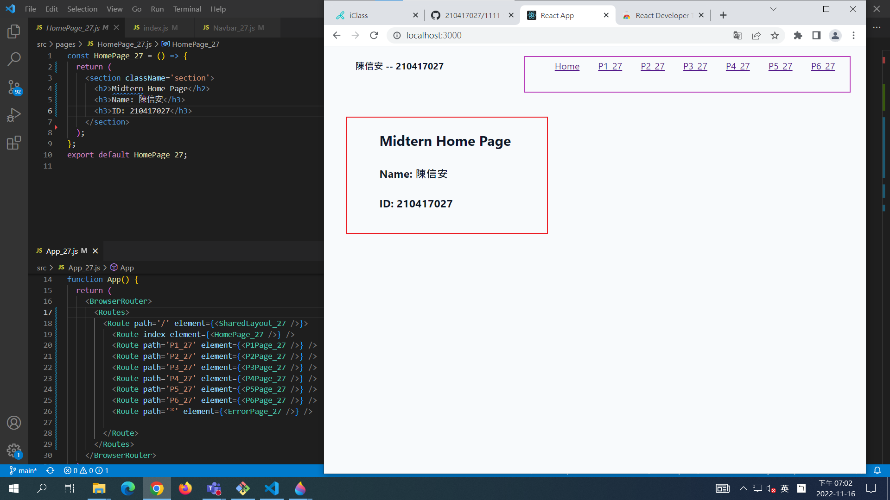
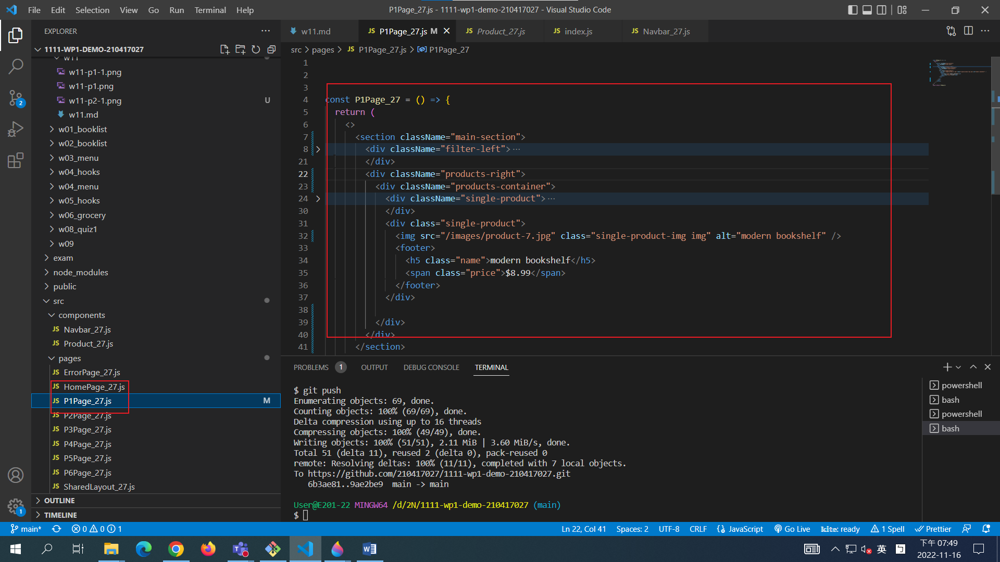
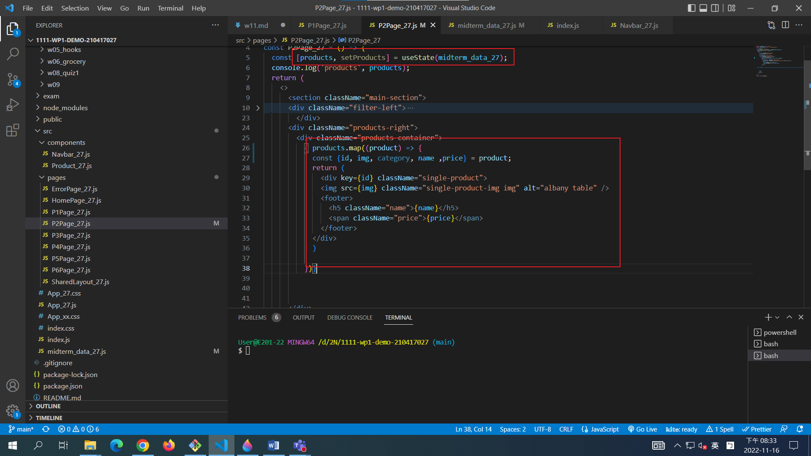

### W11-P1: for midterm P1 and P2




### W11-P1_xx: for midterm P3a




### W11-P2_xx: for midterm P3b




### W11-P3_xx: for midterm P3c


### W11-P4_xx: for midterm P4


### W11-logs: git logs

```
2bd4a50 210417027       Wed Nov 16 21:44:54 2022 +0800  W11-P4_xx: for midterm P4
fecb85f 210417027       Wed Nov 16 21:04:00 2022 +0800  W11-P3_xx: for midterm P3c
af23847 210417027       Wed Nov 16 20:36:05 2022 +0800  W11-P2_xx: for midterm P3b
8deb737 210417027       Wed Nov 16 19:50:48 2022 +0800  W11-P1_xx: for midterm P3a
9ae2be9 210417027       Wed Nov 16 19:07:10 2022 +0800  W11-P1: for midterm P1 and P2
```