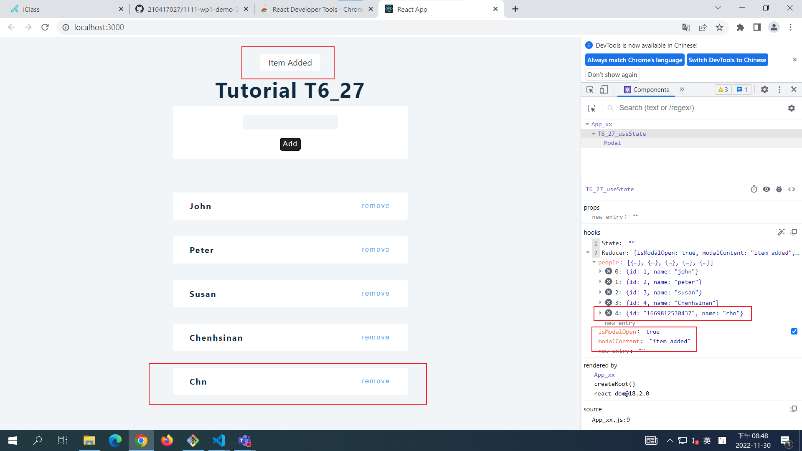
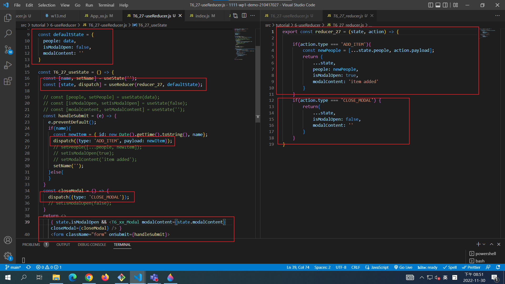
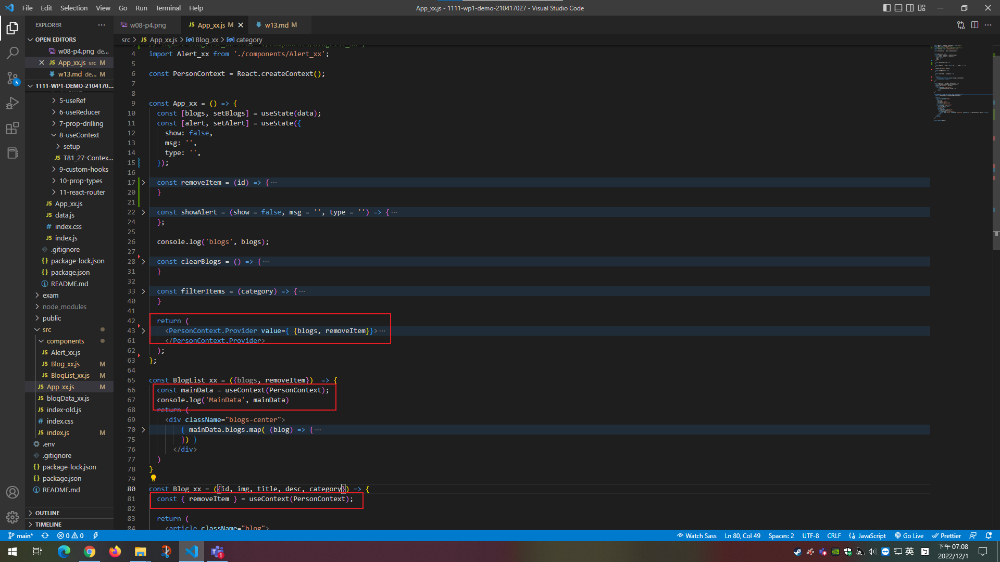
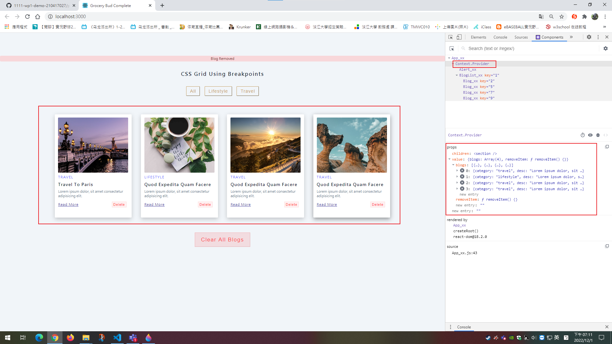
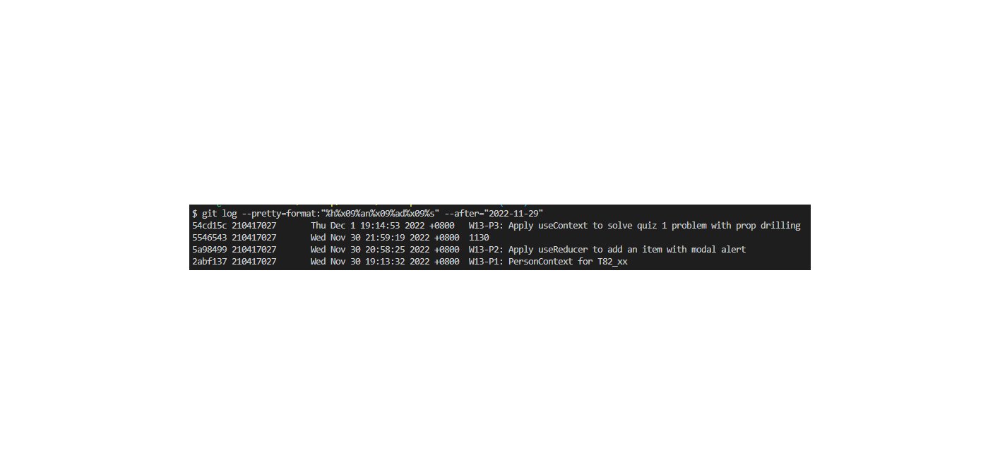

### W13-P1: PersonContext for T82_xx


### W13-P2: Apply useReducer to add an item with modal alert







### W13-P3: Apply useContext to solve quiz 1 problem with prop drilling





### w13-git-logs


```
$ git log --pretty=format:"%h%x09%an%x09%ad%x09%s" --after="2022-11-29"                                                                                                                                                     
54cd15c 210417027       Thu Dec 1 19:14:53 2022 +0800   W13-P3: Apply useContext to solve quiz 1 problem with prop drilling
5546543 210417027       Wed Nov 30 21:59:19 2022 +0800  1130
5a98499 210417027       Wed Nov 30 20:58:25 2022 +0800  W13-P2: Apply useReducer to add an item with modal alert
2abf137 210417027       Wed Nov 30 19:13:32 2022 +0800  W13-P1: PersonContext for T82_xx
```